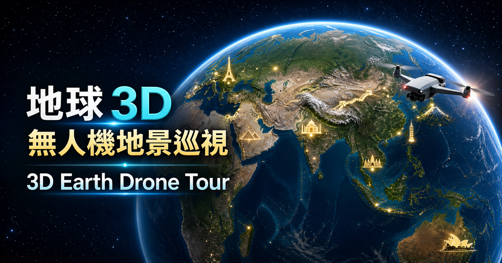

# Facebook Post Bilingual Version

縮圖 / Thumbnail:

---

## 中英文共用版

【地球 3D 無人機地景巡視｜3D Earth Drone Tour】

做了一個可以用無人機視角探索世界 50 個知名地景的 3D 互動網頁。  
I built an interactive 3D web experience for exploring 50 famous world landmarks from a drone-like perspective.

這次改用 MapLibre GL 製作，搭配兩種免金鑰的真實圖資：  
This version uses MapLibre GL with two free, no-key real-world map data sources:

地圖影像：Esri World Imagery 真實衛星影像  
Map imagery: Esri World Imagery satellite basemap

地形高度：AWS 開放高程圖磚，呈現全球真實 3D 地形  
Terrain elevation: AWS open elevation tiles for real global 3D terrain

從地球全景可以看到衛星影像地表，放大後可以飛到珠穆朗瑪峰、大峽谷、富士山、冰峽灣等地景附近，觀察真實山谷、稜線、海岸與城市空間。  
From the global view, learners can inspect satellite imagery and fly closer to places like Mount Everest, the Grand Canyon, Mount Fuji, and ice fjords to observe real terrain, ridgelines, coastlines, and urban landscapes.

互動功能包含：  
Features include:

- 世界 50 個知名地景導覽  
  Navigation for 50 famous world landmarks
- 自動巡航模式  
  Auto-tour mode
- 滑鼠旋轉、平移、縮放  
  Mouse rotation, panning, and zooming
- 鍵盤 WASD / 方向鍵操作  
  Keyboard controls with WASD / arrow keys
- 地形高度滑桿，可加強 3D 起伏  
  Terrain exaggeration slider for stronger 3D relief
- 點選地景後顯示位置與參考資訊  
  Landmark popups with location and reference information

這個作品可以用在地理課、世界地景介紹、地形觀察、衛星影像判讀，也適合讓學生用探索的方式建立空間感。  
This can be used for geography lessons, world landmark introductions, terrain observation, satellite image interpretation, and helping students build spatial awareness through exploration.

作品連結 / Link:  
https://prayer168.github.io/3Dearth-codex/

#數位教材 #地理教學 #3D地球 #MapLibre #衛星影像 #地形觀察 #世界地景 #互動學習  
#DigitalLearning #GeographyEducation #3DEarth #MapLibre #SatelliteImagery #TerrainVisualization #WorldLandmarks #InteractiveLearning
